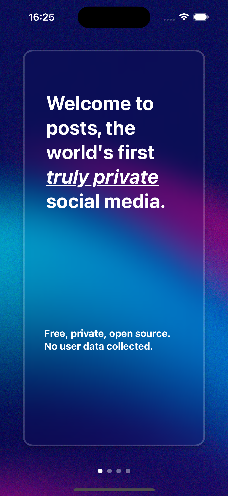
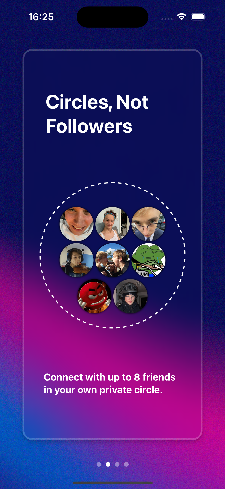
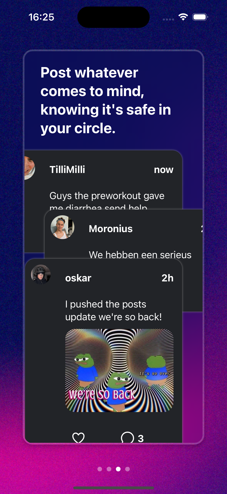
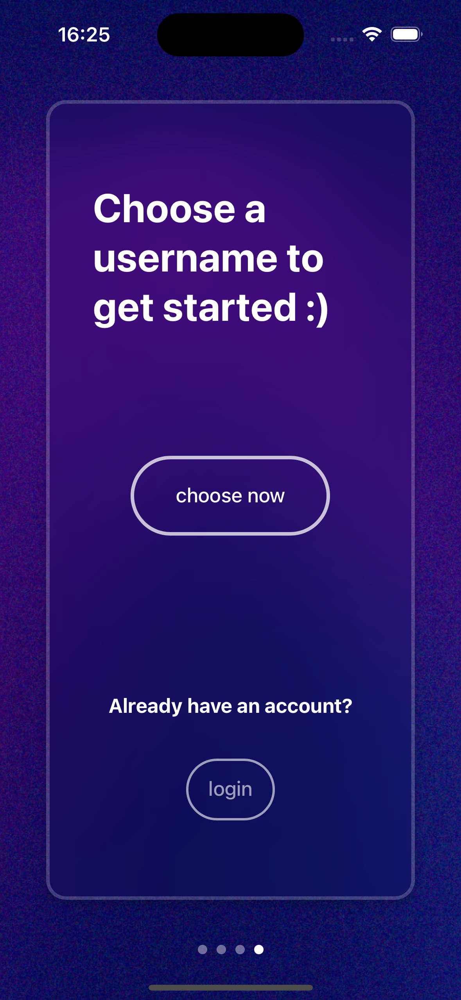

# Posts - Privacy-Focused Microblogging

Posts is a privacy-focused microblogging service designed to connect with friends, not gain followers. With Posts, you can create private circles for up to 15 friends. Due to its thread-based structure, discussions become manageable.







This repository contains the frontend code. The backend code will be available soon.

## Installation

### Prerequisites

- [Node.js](https://nodejs.org) version 16+
- [Ionic CLI](https://ionicframework.com/docs/cli) installed globally
- [Vue CLI](https://cli.vuejs.org/) (optional for custom Vue setup)

### Setup

1. Clone the repository:

   ```bash
   git clone https://github.com/oskar-vdw/posts-frontend
   cd posts-frontend
   ```

2. Install dependencies:

   ```bash
   npm install
   ```

3. Run the application in development mode:

   ```bash
   ionic serve
   ```

Once running, the project should be accessible via [http://localhost:8100](http://localhost:8100) in your browser.

## License

[MIT](https://choosealicense.com/licenses/mit/)
